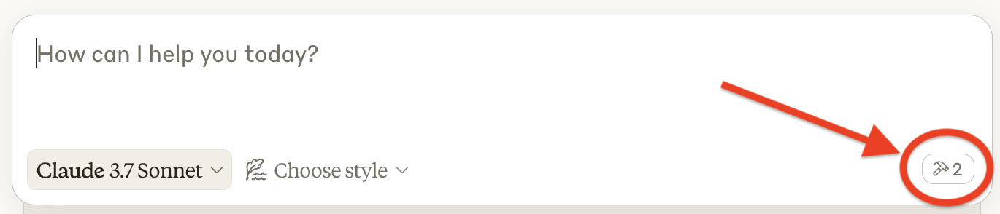
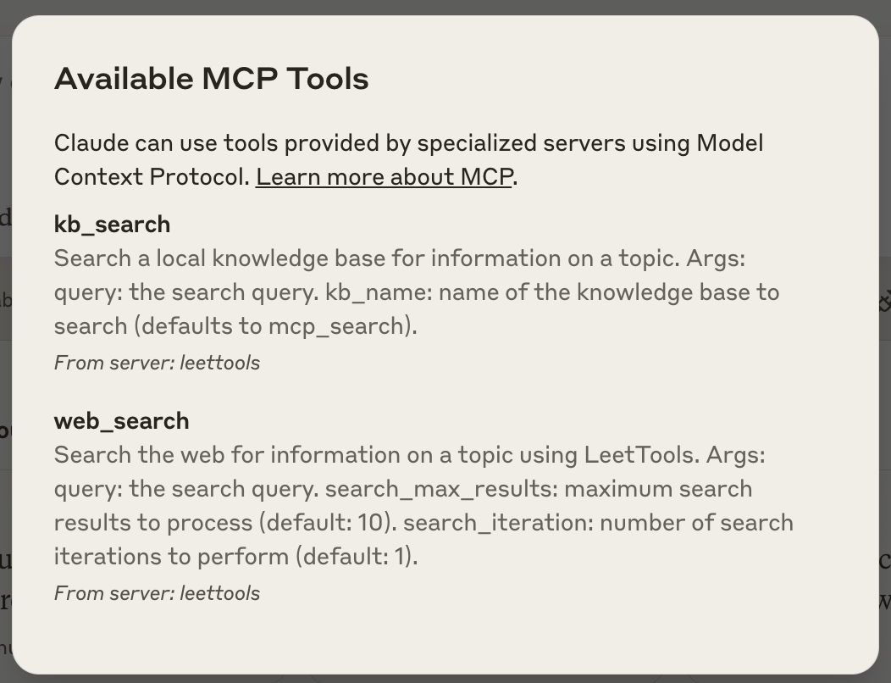

# LeetTools MCP Server

An MCP server implementation that integrates the LeetTools, providing both web and local search capabilities.

## What is LeetTools?
LeetTools is an AI-powered search assistant that enables highly customizable search workflows and delivers tailored output formats from both web and local knowledge bases. Its automated document pipeline handles data ingestion, indexing, and storage, so you can focus on developing workflows without worrying about the underlying infrastructure.

For more details, visit the [LeetTools GitHub Repository](https://github.com/leettools-dev/leettools).

## Smart Search

LeetTools MCP server distinguishes itself from other web search MCP servers by integrating searching, scraping, and filtering into a single tool. By leveraging web search and an in-memory vector database, it delivers highly relevant and accurate results.

## Tools

### `list_kb`
- List all local knowledge bases.

### `create_kb`
- Create a local knowledge base.
- **Inputs:**
  - `knowledge_base_name` (string): name of local knowledge base

### `add_local_to_kb`
- Add files in a local folder to a knowledge base.
- **Inputs:**
  - `local_path`: (string) path to the local folder to add.
  - `knowledge_base_name`: (string) name of the knowledge base to add to.

### `web_search`
- Execute web searches with pagination and filtering
- **Inputs:**
  - `query` (string): web search query
  - `search_max_results` (number, optional): Maximum Search Results (default 1)
  - `search_iteration` (number, optional): Search Pagination (default 1)

### `knowledge_base_search`
- Search for local knowledge base
- **Inputs:**
  - `query` (string): search query for local knowledge base
  - `knowledge_base_name` (string, optional): name of local knowledge base

## Usage with 5ire (Recommended)
1. Follow this [link](https://5ire.app/) to install 5ire MCP client.

2. Go to Tools > New, add fill the following information:
  - `Tool Key`: LeetTools
  - `Command`: npx -y @leettools/leettools-mcp-server
  - `Enviroment Variables`: 
    - LEET_HOME: <your_leet_home>
    - EDS_LLM_API_KEY: <your_openai_api_key>
3. You can also check the 5ire log (on Mac) with the following command:
    ```bash
    tail -n200 ~/Library/Logs/5ire/main.log
    ```
4. Trouble Shooting
  - `Error: MCP error -2: Request timed out`:
This error occurs when the MCP server takes too long to process local files via the add_local_to_kb tool. To resolve the issue, restart the MCP server using the UI (turn it off and then on again).
     
## Usage with Cursor
1. Go to Settings > Cursor Settings > MCP -> add new global MCP server.
2. Add the following to the mcp.json file:
    ```json
    {
        "mcpServers": {
            "leettools": {
                "command": "npx",
                "args": [
                    "-y",
                    "@leettools/leettools-mcp-server",
                ],
                "env": {
                    "LEET_HOME": "Your LeetHome location",
                    "EDS_LLM_API_KEY": "Your OpenAI API Key",
                    "CONTEXT_LENGTH": "10000"
                }
            }
        }
    }
    ```

## Usage with Claude Desktop
1. Follow this [link](https://support.anthropic.com/en/articles/10065433-installing-claude-for-desktop) to install Claude Destop App.

2. Go to Claude > Settings > Developer > Edit Config > claude_desktop_config.json to include the following:

    ```json
    {
        "mcpServers": {
            "leettools": {
                "command": "npx",
                "args": [
                    "-y",
                    "@leettools/leettools-mcp-server",
                ],
                "env": {
                    "LEET_HOME": "Your LeetHome location",
                    "EDS_LLM_API_KEY": "Your OpenAI API Key",
                    "CONTEXT_LENGTH": "10000"
                }
            }
        }
    }
    ```

3. Restart Claude Desktop then make sure it is picking up the tools we've exposed in this mcp server. You can do this by looking for the hammer icon:
   <p align="center">
     
   </p>

   After clicking on the hammer icon, you should see the tools listed:
   <p align="center">
     
   </p>

4. If you encounter issues, follow this [link](https://modelcontextprotocol.io/docs/tools/debugging#debugging-in-claude-desktop) for debugging guidance. You can also check the MCP server log with the following command:
    ```bash
    tail -n 200 -F ~/Library/Logs/Claude/mcp-server-leettools.log
    ```

## Example Usage

### Web Search Examples

Try asking in the MCP client:

> "Can you do a web search and tell me why ServiceNow acquired Moveworks?"

MCP client will use the `web_search` tool to retrieve the latest information about the acquisition.

### Knowledge Base Search Examples

Follow these steps to search your own documents:

1. **First, add a local folder with some PDFs to your knowledge base**:
   > "Can you add local folder /tmp/test into a kb named test_kb?"

2. **Then ask a question about the PDFs**:
   > "Can you search kb 'test_kb' and give me a brief explanation of LLM?"

MCP client will retrieve information from your knowledge base and provide a response based on the documents you've added.

## License

The LeetTools MCP server is licensed under the Apache License, Version 2.0 (the "License"). You may not use this software except in compliance with the License. A copy of the License is provided in the LICENSE file in this repository.

Unless required by applicable law or agreed to in writing, the software distributed under the License is distributed on an "AS IS" BASIS, WITHOUT WARRANTIES OR CONDITIONS OF ANY KIND, either express or implied.